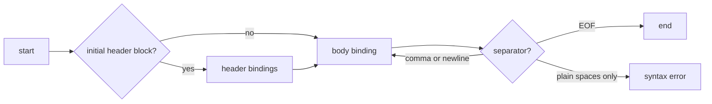
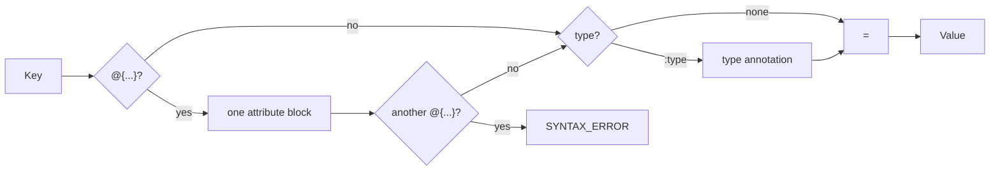
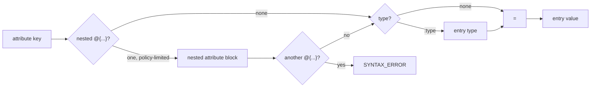
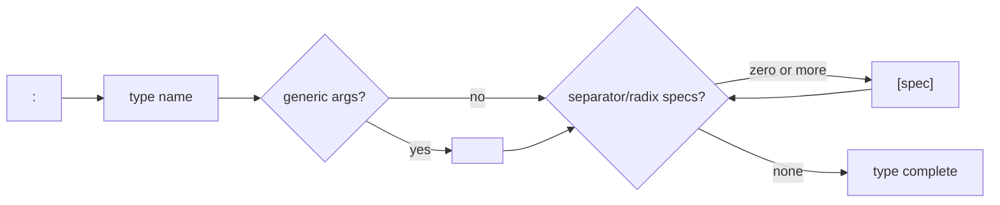
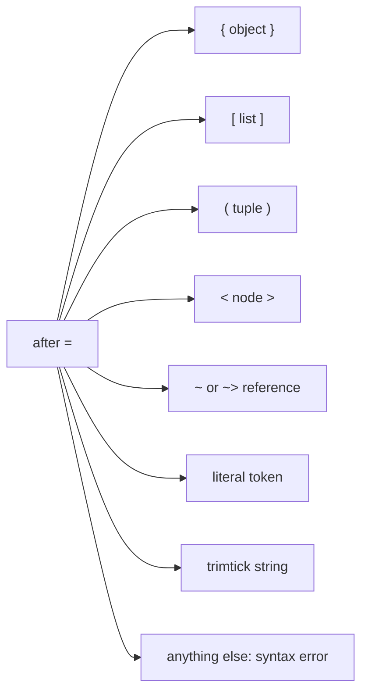
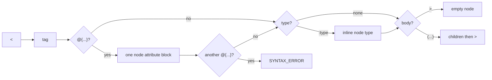

# Appendix: Grammar Flow Cards

Status: informative companion appendix  
Scope: parser-context flow illustrations for AEON Core v1.

This appendix illustrates the legal flow through AEON Core v1 syntax by parser context. It is not a replacement for `../structure-syntax-v1.md`; when this appendix and the structure syntax reference conflict, the structure syntax reference wins.

The key framing is:

- the lexer produces tokens without deciding most structural legality;
- parser contexts decide what may legally follow;
- recovery may produce partial syntax trees, but a parse with errors is not a successful parse unless a recovery surface explicitly says so.

## 1. Document Flow



Rules:

- shorthand header bindings and structured header bindings are recognized only in the initial header block;
- after the first body binding, `aeon:mode = "strict"` is parsed as an ordinary typed binding unless another rule rejects it;
- top-level binding keys in one document must be unique after key decoding;
- duplicate top-level keys fail closed with `DUPLICATE_KEY`.

## 2. Binding Head Flow

Canonical binding head order is:

```aeon
key@{attributes}:type = value
```



Legal:

```aeon
a = 1
a@{meta=1} = 1
a:int = 1
a@{meta=1}:int = 1
```

Illegal:

```aeon
a:int@{meta=1} = 1
a@{x=1}@{y=2} = 1
```

## 3. Attribute Entry Flow

Attribute entries reuse the binding-head shape, but live inside `@{...}`:

```aeon
a@{entry@{nested=1}:type = value} = payload
```



Rules:

- duplicate keys inside one attribute map fail closed with `DUPLICATE_KEY`;
- one nested attribute head is legal when `max_attribute_depth` allows it;
- repeated heads on one attribute entry are illegal, even when depth is raised;
- `key@{...}:type = value` is legal; `key:type@{...} = value` is not.

Examples:

```aeon
a@{x=1, y=2} = 3
a@{x@{origin="core"} = 2} = 1
```

Rejected:

```aeon
a@{x=1, x=2} = 3
a@{x@{y=1}@{z=2} = 3} = 4
a@{x:int@{y=1} = 2} = 3
```

## 4. Type Annotation Flow



Rules:

- binding and attribute-entry type annotations must be followed by `=`;
- anonymous typed values use `:type = value` only in list, tuple, and node-child contexts;
- node-head inline datatypes are syntactically narrower than ordinary binding types and do not accept generic or bracket specs in Core v1 node-head syntax;
- generic and separator depth policies are enforced by parser options.

## 5. Value Dispatch



Value starts include:

| Start                            | Value family                            |
| -------------------------------- | --------------------------------------- |
| `{`                              | object                                  |
| `[`                              | list                                    |
| `(`                              | tuple                                   |
| `<`                              | node                                    |
| `~`, `~>`                        | clone or pointer reference              |
| string token                     | string                                  |
| number-like token                | number, infinity, NaN                   |
| `!` form                         | null literal                            |
| boolean/switch keyword           | boolean or switch                       |
| `#`, `%`, `$`, `^` literal token | hex, radix, encoding, separator literal |
| trimtick opener                  | trimtick string                         |

An identifier by itself is not a value. Use a reference marker for reference values.

## 6. Container Flow Matrix

| Context       | Entry form              | Separators       | Close        | Attribute rule                                         |
| ------------- | ----------------------- | ---------------- | ------------ | ------------------------------------------------------ |
| Document      | `Binding`               | comma or newline | EOF          | attributes attach to binding head                      |
| Object        | `Binding`               | comma or newline | `}`          | attributes attach to member binding head               |
| List          | `Value` or `TypedValue` | comma or newline | `]`          | no floating binding head                               |
| Tuple         | `Value` or `TypedValue` | comma or newline | `)`          | no floating binding head                               |
| Node children | `Value` or `TypedValue` | comma or newline | `)` then `>` | node head attributes appear before children            |
| Attribute map | `AttributeEntry`        | comma or newline | `}`          | nested entry head allowed only once and policy-limited |

Object attachment examples:

```aeon
x@{meta=1} = { k = 2 }
x = { k@{meta=1} = 2 }
```

Rejected floating form:

```aeon
x = { @{meta=1} k = 2 }
```

## 7. Node Head Flow



Rules:

- node heads may have one attribute block;
- repeated node head attribute blocks are illegal;
- child-bearing nodes require the final `>` after the child list closes.

## 8. Reference Path Flow

```mermaid
flowchart LR
  R["~ or ~>"] --> BASE{"path start"}
  BASE --> ROOT["$"]
  BASE --> MEM["identifier or quoted member"]
  BASE --> BR["[index or quoted member]"]
  ROOT --> SEG{"segment"}
  MEM --> CONT{"continue?"}
  BR --> CONT
  SEG --> CONT
  CONT -->|.| MEM2["member segment"]
  CONT -->|[| BR2["index or quoted member"]
  CONT -->|@| ATTR["attribute segment"]
  CONT -->|end| DONE["reference complete"]
  MEM2 --> CONT
  BR2 --> CONT
  ATTR --> CONT
```

Rules:

- `$` is the explicit root;
- dot traversal and bracket traversal address data namespace segments;
- `@key` and `@["key"]` address attribute namespace segments;
- empty quoted member segments and empty quoted attribute segments are invalid.

## 9. Comments And Trivia Flow

Comments are not values, bindings, or separators by themselves.

| Surface                    | Lexer/parser role             | Grammar effect                                                |
| -------------------------- | ----------------------------- | ------------------------------------------------------------- |
| spaces/tabs                | layout trivia                 | never separate two same-line bindings by themselves           |
| newline                    | structural token when enabled | separator only in contexts that consume newline               |
| line comment               | comment/trivia                | ends at newline; surrounding grammar still decides separation |
| block comment              | comment/trivia                | may span newlines; does not become a value                    |
| structured comment channel | annotation side channel       | attachment rules do not redefine syntax                       |

Examples:

```aeon
a = 1 // comment
b = 2
```

The newline after the line comment separates the bindings; the comment itself does not.

```aeon
a = 1 /* comment */ b = 2
```

Plain spaces plus a block comment do not create a document binding separator.

## 10. Ambiguity Checklist

| Ambiguity                         | Legal form                         | Illegal form            | Expected diagnostic |
| --------------------------------- | ---------------------------------- | ----------------------- | ------------------- |
| duplicate top-level key           | distinct top-level keys            | `a=1\na=2`              | `DUPLICATE_KEY`     |
| duplicate object member key       | distinct member keys               | `x={a=1,a=2}`           | `DUPLICATE_KEY`     |
| duplicate attribute key           | distinct attribute keys            | `a@{x=1,x=2}=3`         | `DUPLICATE_KEY`     |
| object vs member attribute        | `x@{m=1}={k=2}` or `x={k@{m=1}=2}` | `x={@{m=1} k=2}`        | `SYNTAX_ERROR`      |
| nested vs repeated attribute head | `a@{x@{y=1}=2}=3`                  | `a@{x@{y=1}@{z=2}=3}=4` | `SYNTAX_ERROR`      |
| binding attribute order           | `a@{x=1}:int=2`                    | `a:int@{x=1}=2`         | `SYNTAX_ERROR`      |
| node attribute order              | `<tag@{x=1}:node>`                 | `<tag:node@{x=1}>`      | `SYNTAX_ERROR`      |
| typed anonymous context           | `a=[:int=1]`                       | `a=:int=1`              | `SYNTAX_ERROR`      |
| space-only separation             | `a=1\nb=2` or `a=1,b=2`            | `a=1 b=2`               | `SYNTAX_ERROR`      |

These examples should remain mirrored by implementation tests or CTS cases when the behavior is normative.
