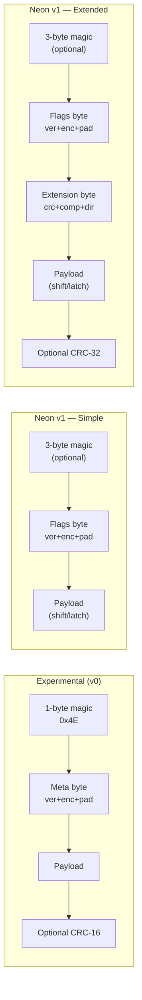

# Neon v1 — Container & Encoding Design

The first formal specification for the Neon codec — replacing the experimental v0 prototype while preserving its bit-packing philosophy.

---

## 1. Magic Bytes (Optional)

The Neon v1 format uses a **3-byte magic header** designed to completely eliminate false positives from ASCII, Latin, and UTF-8 text formats. 

If the container is embedded in a context where a Neon payload is expected (e.g., as the value of a specific AEON variable, or over a dedicated transport), the entire magic header **can be omitted**. 

When present, the magic sequence uses `0xD7` as the start byte, followed by `0xFF` (which is strictly invalid in UTF-8, guaranteeing the payload cannot be mistaken for valid text), and a third byte selecting the parsing mode:

| Mode | Bytes | Header size (w/ magic) | Header size (w/o magic) |
|:---|:---|:---|:---|
| **Simple** | `D7 FF 9B` | 4 bytes total | 1 byte total |
| **Extended** | `D7 FF BB` | 5+ bytes total | 2+ bytes total |

- **Simple mode** (`D7 FF 9B`): Minimal container — magic + 1 flags byte + payload. 
- **Extended mode** (`D7 FF BB`): Same flags byte, followed by extension byte(s) for advanced features.

Detection: check byte 0 = `0xD7`, byte 1 = `0xFF`, then byte 2 tells you which parsing path to take. If the magic is omitted, the parser jumps straight to the Flags byte.

---

## 2. Header Layout

### Simple Mode

```
Byte 0: 0xD7          ← magic byte 1 (optional)
Byte 1: 0xFF          ← magic byte 2 (optional)
Byte 2: 0x9B          ← magic byte 3 (optional, simple mode)
Byte 3: Flags
  ┌─────────────────────────────────────────┐
  │ Bits 7-5│ Version (0–7)                 │
  ├─────────┼───────────────────────────────┤
  │ Bits 4-3│ Encoding                      │
  │         │ 00 = 2p6b-gp (general purpose) │
  │         │ 01 = 3p6b                     │
  │         │ 10 = utf-8                    │
  │         │ 11 = 2p6b-aeon                │
  ├─────────┼───────────────────────────────┤
  │ Bits 2-0│ Pad bits (0–7)                │
  └─────────┴───────────────────────────────┘
...payload bytes...
```

**4 bytes (with magic)** or **1 byte (no magic)**. Every bit serves the payload.

### Extended Mode

```
Byte 0: 0xD7          ← magic byte 1 (optional)
Byte 1: 0xFF          ← magic byte 2 (optional)
Byte 2: 0xBB          ← magic byte 3 (optional, extended mode)
Byte 3: Flags (identical layout to simple mode)
  Bits 7-5: Version
  Bits 4-3: Encoding
  Bits 2-0: Pad bits
Byte 4: Extension flags
  ┌─────────────────────────────────────────┐
  │ Bit 7   │ CRC-32 (0=none, 1=4B trailer)│
  ├─────────┼───────────────────────────────┤
  │ Bit 6   │ Compression (0=none, 1=yes)  │
  ├─────────┼───────────────────────────────┤
  │ Bit 5   │ Directory (0=single, 1=multi)│
  ├─────────┼───────────────────────────────┤
  │ Bits 4-1│ Reserved (must be 0)          │
  ├─────────┼───────────────────────────────┤
  │ Bit 0   │ Chain (0=done, 1=more ext.)  │
  └─────────┴───────────────────────────────┘
Byte 5 (conditional, if compression = 1):
  0x00 = Deflate, 0x01 = Brotli
...payload bytes...
...optional CRC-32 trailer (4 bytes)...
```

> [!NOTE]
> The `Flags` byte is **identical** in both modes. A parser always reads version, encoding, and pad the same way. The only difference is whether the extension byte exists.

### Size comparison

| Scenario | Experimental (v0) | Neon v1 (with magic) | Neon v1 (no magic) |
|:---|:---|:---|:---|
| Simple payload, no extras | 2 bytes | **4 bytes** | **1 byte** |
| Payload + CRC-32 | n/a | 5 bytes | 2 bytes |
| Compressed payload | 4 bytes (v0-ext) | 6 bytes | 3 bytes |
| Multi-payload + compressed | 4–5 bytes (v0-ext) | 6–7 bytes | 3–4 bytes |

Advanced features pay +1 byte for the extension byte.

---

## 3. Character Maps

### 2p6b-gp — General Purpose, 2-Page, 6-Bit

**Sticky Punctuation (indices 27–47)** — present on both pages, never triggers a page switch:

| Idx | Char | Idx | Char | Idx | Char | Idx | Char |
|:----|:-----|:----|:-----|:----|:-----|:----|:-----|
| 27  | `` ` ``  | 32  | ` `  | 37  | `=`  | 42  | `)`  |
| 28  | `"`  | 33  | `.`  | 38  | `:`  | 43  | `[`  |
| 29  | `_`  | 34  | `,`  | 39  | `{`  | 44  | `]`  |
| 30  | `\n` | 35  | `!`  | 40  | `}`  | 45  | `<`  |
| 31  | `\t` | 36  | `?`  | 41  | `(`  | 46  | `>`  |
|     |      |     |      |     |      | 47  | *(UTF marker)* |

> [!TIP]
> Key design choices: **space at index 32** aligns with ASCII. **UTF marker at sticky index 47** means UTF-8 escape runs are accessible from any page without a page switch (was previously on page 1 only). **Single quote** (`'`) sits at page 1 index 25 since `'` and `"` are interchangeable in AEON — `"` remains available on any page via sticky index 28.

**Page 0 — Lowercase**

| Idx | Char | | Idx | Char | | Idx | Char |
|:----|:-----|---|:----|:-----|---|:----|:-----|
| 0   | *(reserved)* | | 10  | `j`  | | 20  | `t`  |
| 1   | `a`  | | 11  | `k`  | | 21  | `u`  |
| 2   | `b`  | | 12  | `l`  | | 22  | `v`  |
| 3   | `c`  | | 13  | `m`  | | 23  | `w`  |
| 4   | `d`  | | 14  | `n`  | | 24  | `x`  |
| 5   | `e`  | | 15  | `o`  | | 25  | `y`  |
| 6   | `f`  | | 16  | `p`  | | 26  | `z`  |
| 7   | `g`  | | 17  | `q`  | | 27–47 | *sticky* |
| 8   | `h`  | | 18  | `r`  | |     |      |
| 9   | `i`  | | 19  | `s`  | |     |      |

Prefixes from page 0: `110` = shift/latch to page 1, `1111` = case shift (uppercase)

**Page 1 — Data / Digits**

| Idx | Char | | Idx | Char | | Idx | Char |
|:----|:-----|---|:----|:-----|---|:----|:-----|
| 0   | *(binary marker)* | | 11  | `+`  | | 21  | `@`  |
| 1   | `0`  | | 12  | `-`  | | 22  | `#`  |
| 2   | `1`  | | 13  | `*`  | | 23  | `$`  |
| 3   | `2`  | | 14  | `/`  | | 24  | *(reserved)* |
| 4   | `3`  | | 15  | `\`  | | 25  | `'`  |
| 5   | `4`  | | 16  | `\|` | | 26  | `;`  |
| 6   | `5`  | | 17  | `^`  | | 27–47 | *sticky* |
| 7   | `6`  | | 18  | `&`  | |     |      |
| 8   | `7`  | | 19  | `%`  | |     |      |
| 9   | `8`  | | 20  | `~`  | |     |      |
| 10  | `9`  | |     |      | |     |      |

Prefixes from page 1: `110` = shift/latch to page 0

### 2p6b-aeon — AEON-Optimized, 2-Page, 6-Bit

Tailored for AEON syntax with **smart-equals combinators** that merge `=` with page switching, eliminating a 3–4 bit prefix on the most common AEON pattern (`key=value`).

**Page 0 — Lowercase + @**

| Idx | Char | | Idx | Char | | Idx | Char |
|:----|:-----|---|:----|:-----|---|:----|:-----|
| 0   | *(reserved)* | | 10  | `j`  | | 20  | `t`  |
| 1   | `a`  | | 11  | `k`  | | 21  | `u`  |
| 2   | `b`  | | 12  | `l`  | | 22  | `v`  |
| 3   | `c`  | | 13  | `m`  | | 23  | `w`  |
| 4   | `d`  | | 14  | `n`  | | 24  | `x`  |
| 5   | `e`  | | 15  | `o`  | | 25  | `y`  |
| 6   | `f`  | | 16  | `p`  | | 26  | `z`  |
| 7   | `g`  | | 17  | `q`  | | 27  | `@`  |
| 8   | `h`  | | 18  | `r`  | | 28–47 | *sticky* |
| 9   | `i`  | | 19  | `s`  | |     |      |

**Page 1 — Data / Digits / Symbols**

| Idx | Char | | Idx | Char | | Idx | Char |
|:----|:-----|---|:----|:-----|---|:----|:-----|
| 0   | *(binary marker)* | | 10  | `0`  | | 20  | `~`  |
| 1   | `1`  | | 11  | `+`  | | 21  | `'`  |
| 2   | `2`  | | 12  | `-`  | | 22  | `#`  |
| 3   | `3`  | | 13  | `*`  | | 23  | `$`  |
| 4   | `4`  | | 14  | `/`  | | 24  | `?`  |
| 5   | `5`  | | 15  | `\`  | | 25  | `;`  |
| 6   | `6`  | | 16  | `\|` | | 26  | `!`  |
| 7   | `7`  | | 17  | `^`  | | 27  | `_`  |
| 8   | `8`  | | 18  | `&`  | | 28–47 | *sticky* |
| 9   | `9`  | | 19  | `%`  | |     |      |

**Sticky (indices 28–47)** — shared across both pages:

| Idx | Char | Idx | Char | Idx | Char | Idx | Char |
|:----|:-----|:----|:-----|:----|:-----|:----|:-----|
| 28  | `.`  | 33  | `=`  | 38  | `:`  | 43  | `[`  |
| 29  | `,`  | 34  | *= + latch* | 39  | `{`  | 44  | `]`  |
| 30  | `\n` | 35  | *= + shift* | 40  | `}`  | 45  | `<`  |
| 31  | `\t` | 36  | `"`  | 41  | `(`  | 46  | `>`  |
| 32  | ` `  | 37  | `` ` ``  | 42  | `)`  | 47  | *(UTF marker)* |

> [!IMPORTANT]
> **Smart-equals combinators** (indices 33–35):
> - **33** = plain `=` (no page effect)
> - **34** = `=` + **latch** to other page — e.g. `a=43.23` emits `a` + smart-latch + `43.23` (saves 3–4 bits vs `=` + separate page switch)
> - **35** = `=` + **shift** to other page for one char, then auto-return — e.g. `a=#FFFFFF` emits `a` + smart-shift + `#` + auto-return + `FFFFFF`

### 3p6b — 3-Page, 6-Bit

3p6b uses its own sticky punctuation arrangement (indices 27–47) shared across all three pages:

| Idx | Char | Idx | Char | Idx | Char | Idx | Char |
|:----|:-----|:----|:-----|:----|:-----|:----|:-----|
| 27  | `.`  | 32  | `:`  | 37  | ` `  | 42  | `[`  |
| 28  | `,`  | 33  | `` ` ``  | 38  | `\t` | 43  | `]`  |
| 29  | `!`  | 34  | `'`  | 39  | `\n` | 44  | `{`  |
| 30  | `?`  | 35  | `"`  | 40  | `(`  | 45  | `}`  |
| 31  | `=`  | 36  | `_`  | 41  | `)`  | 46  | `<`  |
|     |      |     |      |     |      | 47  | `>`  |

**Page 0 — Lowercase**: indices 1–26 = `a`–`z`, 27–47 = sticky

**Page 1 — Uppercase**: indices 1–26 = `A`–`Z`, 27–47 = sticky

**Page 2 — Digits / Symbols**

| Idx | Char | | Idx | Char | | Idx | Char |
|:----|:-----|---|:----|:-----|---|:----|:-----|
| 0   | *(binary marker)* | | 9   | *(reserved)* | | 18  | `2`  |
| 1   | `-`  | | 10  | `@`  | | 19  | `3`  |
| 2   | `+`  | | 11  | `%`  | | 20  | `4`  |
| 3   | `/`  | | 12  | `^`  | | 21  | `5`  |
| 4   | `\`  | | 13  | `&`  | | 22  | `6`  |
| 5   | `~`  | | 14  | `*`  | | 23  | `7`  |
| 6   | `#`  | | 15  | `\|` | | 24  | `8`  |
| 7   | `$`  | | 16  | `0`  | | 25  | `9`  |
| 8   | *(UTF marker)* | | 17  | `1`  | | 26  | `;`  |
|     |      | |     |      | | 27–47 | *sticky* |

Page switching: `110` = jump +2 pages (mod 3), `111` = jump +1 page (mod 3)

---

## 4. Custom Character Maps (Extended Mode)

Extension bit 4 signals a **custom character map** embedded in the header, replacing the standard map for the selected encoding.

### Extension byte (updated)

```
Byte 3: Extension flags
  Bit 7:    CRC-32
  Bit 6:    Compression
  Bit 5:    Directory (multi-payload)
  Bit 4:    Custom map (0=standard, 1=inline map follows)
  Bit 3:    Preset Dictionary (0=none, 1=dictionary ID follows)
  Bits 2-1: Reserved (must be 0)
  Bit 0:    Chain
```

When bit 4 = 1, a compact map table appears after the extension byte(s), before the payload:

```
[1 byte]  Page count (1–3)
For each page:
  [1 byte]  Entry count (N)
  [N bytes] Character codes (UTF-8 code points ≤ 127 as single bytes)
```

Entries are assigned indices 1–N in order. Index 0 remains reserved (binary/UTF marker). Sticky punctuation slots (27–47) can be overridden or left as default if the entry count is ≤ 26.

> [!NOTE]
> Custom maps are a **niche feature** for domain-specific content where the standard character frequencies don't apply. The typical AEON encoder would never set this flag — it exists for extensibility without burning a version increment.

---

## 5. Shift vs. Latch Page Switching (2p6b)

### Encoding selection

The encoder auto-selects the best encoding for the content:
- **2p6b**: Mostly lowercase text with occasional digits/symbols (typical AEON)
- **3p6b**: Mixed-case text — has dedicated pages for lowercase, uppercase, and digits/symbols
- **utf-8**: Anything with significant non-ASCII content

3p6b naturally handles uppercase without any special mechanism, since uppercase characters sit on their own page (page 1) at 6 bits each. Shift/latch improvements below apply to 2p6b specifically.

### Proposed page-switching

```
From page 0 (lowercase):
  110   →  Shift to page 1 (one char, auto-return)     3 bits
  1110  →  Latch to page 1 (permanent)                  4 bits
  1111  →  Case shift (one char, stay on page 0)        4 bits

From page 1 (data/digits):
  110   →  Shift to page 0 (one char, auto-return)      3 bits
  111   →  Latch to page 0 (permanent)                   3 bits
```

### Bit-cost examples

**Isolated digit** (`abc1def`): **45 bits** (saves 3 vs current 48)
| Step | Current | Proposed |
|:---|:---|:---|
| `abc` | 18 | 18 |
| → page 1 | 3 (latch) | 3 (shift) |
| `1` | 6 | 6 |
| → page 0 | 3 (latch) | 0 (auto) |
| `def` | 18 | 18 |

**Digit run** (`abc12345def`): **73 bits** (+1 vs current 72)

**Case shift** (`Hello`): **34 bits** (+1 vs current 33 — for uppercase-heavy text, the encoder selects 3p6b instead)

The DP solver automatically picks shift vs. latch at each transition, so it never chooses the worse option.

---

## 6. CRC-32 Checksum

When extension bit 7 = 1: append a **4-byte CRC-32** (IEEE 802.3) trailer, computed over the stored payload bytes. CRC-16 is dropped entirely.

## 7. Optimal Selection (Racing)

The Neon v1 encoder should support both **explicit selection** and **dynamic racing**.

### Encoding Selection

By default, the encoder "races" the applicable encodings against the input text and selects whichever produces the smallest bitstream.

1. `2p6b-aeon`: Raced if the input parses as valid AEON (highest priority for AEON content due to smart-equals).
2. `2p6b-gp`: Raced for general text. Wins on predominantly lowercase/identifier-heavy text.
3. `3p6b`: Raced for general text. Wins when uppercase letters appear frequently enough that `2p6b-gp`'s shift/latch costs accumulate.
4. `utf-8`: Raced for all text. Wins when the input contains significant multi-byte Unicode characters that would otherwise require expensive escape sequences in the bit-packed codecs.

Users can bypass the race by explicitly requesting a specific encoding.

### Compression Selection

By default, **compression is OFF**. The payload is simply bit-packed.
If the user requests compression, they can either specify an algorithm or ask the encoder to race them.

- **Deflate** (`0x00`)
- **Brotli** (`0x01`)

**Preset Dictionaries:**
If Extension Bit 3 (`Preset Dictionary`) is set, a 1-byte **Dictionary ID** (0–255) is written to the header immediately after the compression method byte (if present). The encoder/decoder must use this pre-shared, application-defined dictionary buffer to seed the Deflate or Brotli algorithm. This allows massive compression ratios on tiny payloads based on domain-specific dictionaries (e.g., standard AEON UI strings).

When compression racing is enabled, the encoder:
1. Encodes the payload using the winning encoding (from the step above).
2. Compresses that payload using Deflate (with dictionary if specified).
3. Compresses that payload using Brotli (with dictionary if specified).
4. Compares the sizes: `Uncompressed` vs `Deflate + overhead` vs `Brotli + overhead`.
5. Selects the smallest option.

> [!NOTE]
> Because the extension mode adds 1 byte for the compression flag, 1 byte for the method, and optionally 1 byte for the Dictionary ID, compression must save at least 3–4 bytes to "win" the race. For very small payloads without a powerful preset dictionary, uncompressed will naturally win.

---

## 8. Summary



| Feature | Experimental (v0) | Neon v1 |
|:---|:---|:---|
| Magic | 1 byte (`0x4E`) | 3 bytes (`D7 FF 9B` / `BB`) or omitted |
| Min header (simple) | 2 bytes | 4 bytes (1 byte if omitted) |
| Min header (extended) | 4 bytes (v0-ext) | 5 bytes (2 bytes if omitted) |
| False-positive risk | 1 in 256 | Zero (contains invalid UTF byte 0xFF) |
| Encodings | 4 × 2-bit | 2p6b-gp, 3p6b, utf-8, 2p6b-aeon |
| Checksum | CRC-16 | CRC-32 |
| Page switching | Latch only | Shift + Latch (2p6b) |
| Mixed-case text | 3p6b (same) | 3p6b (dedicated uppercase page) |
| AEON optimization | — | 2p6b-aeon (smart-equals combinators) |
| Isolated digit cost | 12 bits | 9 bits (2p6b) |
| Extensibility | 1-byte dict ID (V0) | Extension bytes (CRC-32, Compression, Custom Maps, Preset Dictionaries) |
